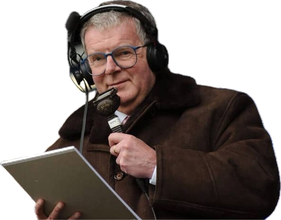

# Motson

**Live fixtures, scores and group standings for the 2026 FIFA World Cup.**

### → [motson.jamesmaggs.com](https://motson.jamesmaggs.com)

Named in tribute to the late, great [John Motson](https://en.wikipedia.org/wiki/John_Motson) — the voice of football. Every kick-off is shown in your own local timezone, and scores roll in as matches finish.

## Browse

- **All fixtures** — [motson.jamesmaggs.com](https://motson.jamesmaggs.com)
- **A group** — its matches alongside a live standings table, e.g. [Group A](https://motson.jamesmaggs.com/groups/A) or [Group F](https://motson.jamesmaggs.com/groups/F)
- **A team** — every fixture they play across the group stage and knockouts, with their group standings, e.g. [Canada](https://motson.jamesmaggs.com/teams/canada), [Mexico](https://motson.jamesmaggs.com/teams/mexico) or [Brazil](https://motson.jamesmaggs.com/teams/brazil)

## Add it to your calendar

Subscribe once and the whole tournament lands in your calendar, updating itself automatically as fixtures move and scores come in — event titles even carry the final score once a match is done.

### → [webcal://motson.jamesmaggs.com/calendar.ics](webcal://motson.jamesmaggs.com/calendar.ics)

Works with Apple Calendar, Google Calendar, and anything else that speaks iCalendar.

---

How this project is built and specified lives in [CLAUDE.md](CLAUDE.md).
